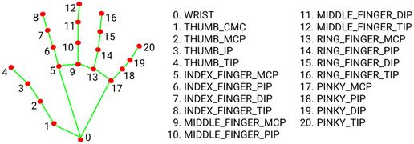

# sesion-02

2026-08-20

al inicio conversamos de la tarea y dificultades, y luego presentaron todos los grupos

## cátedra

instrucción > dato > condición > secuencia > repetición

### python

Lenguaje de programación creado en los años 70 con énfasis en la legibilidad y simplicidad

Tiene grandes capacidades para conectarse diversos dispositivos, librerías, etc.

#### open CV

procesamiento imágenes, video, visión computacional, operaciones matemáticas, seguimiento de movimiento, detección y reconocimiento.

openCV abre la cámara y permite hacer correlaciones.

#### mediaPipe

detecta manos, rostros, posturas, objetos, gestos, audio, texto.

mediaPie le da esqueleto al mundo, y openCV hace los cálculos matemáticos para saber al distancia entre los puntos(y con ello saber qué gesto es)

## clase github

introducción a los repositorios, colaboración, open source, etc.

## conceptos relevantes

- [python](https://www.python.org/)
- [W3Schools - Python](https://www.w3schools.com/python/default.asp)
- [Codedex - Python](https://www.codedex.io/python)
- librerías pyhton
  - [NumPy](https://numpy.org/)
  - [pandas](https://pandas.pydata.org/)
  - [Matplotlib](https://matplotlib.org/)
  - [SciPy](https://scipy.org/)
  - [PyTorch](https://pytorch.org/)
  - [TensorFlow](https://www.tensorflow.org/)
  - [SciKit-learn](https://scikit-learn.org/stable/)
  - **[MediaPipe](https://developers.google.com/edge/mediapipe/solutions/guide)**
  - [Transformers](https://pypi.org/project/transformers/)
  - **[OpenCV](https://opencv.org/)**
- [Meowmeow cat cam meme detector](https://github.com/fefeliperoar/gatos)
- [ekimroyrp - DLACoral](https://github.com/ekimroyrp/260716_DLACoral)