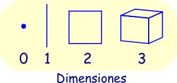

# sesion-06

2026-09-24

Hoy día, vuelta del receso de fiestas patrias, entrega de la [tarea-03](../tareas/tarea-03/README.md), comentarios y rúbrica disponibles [aquí](../tareas/tarea-03/entregas/README.md)

Luego conversamos sobre el siguiente encargo.

Conversamos sobre el slit scan, un fenómeno donde incorporamos la variable temporal en imágenes.

Un video se compone de la sucesión de una serie de imágenes. La cantidad de imágenes que se muestran por segundo se llama FPS(frames por segundo).

## links relevantes

- [Sketch Tools](https://sketchdesign.club/)
- [Slit Scan](https://github.com/fefeliperoar/slit-scan) (Repo de base para la tarea-04)
- 
- 
- 
