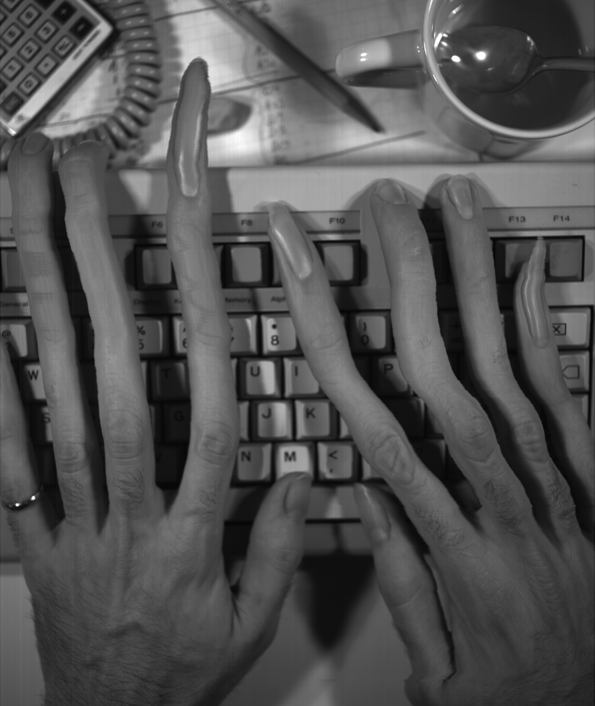
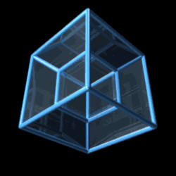

# tarea-04

A entregar el jueves 01 de octubre. Hasta las 11:00am, vía [canvas](https://udp.instructure.com).

Para la tarea-04 deberán integrar el elementos del tiempo dentro de su entrega.

.

Realiza un video de 30 a 45 segundos que haga visible el paso del tiempo, construido con frames extraídos de uno o más videos en la herramienta Slit Scan.Links to an external site. Acompañalo con un texto breve que explique cómo lo hiciste y qué piensas del tiempo como material de diseño.

El objetivo es explorar el video no solo como imágenes que cambian, sino como un volumen de momentos que puedes ordenar, deformar y recorrer. Te interesa menos contar una historia y más que se note el tiempo: que se acumule, se estire, se repita o cambie de color.

## La herramienta

Trabajarás en Tiempo e imagen: Slit ScanLinks to an external site., que corre en el navegador. Tus videos no se suben a ningún servidor: todo se procesa en tu equipo.

La herramienta separa un video en frames y los apila en el espacio 3D. Sobre esa pila puedes trabajar con:

- Distancia y orden: qué tan separados están los frames y en qué sentido.
- Escala: constante, lineal u onda, a partir de un frame de referencia.
- Rotación: un giro acumulado frame a frame.
- Opacidad y edge fade: qué tan visibles son los frames y cómo se desvanecen sus bordes.
- Procesar imagen: recortar por brillo o color, mostrar solo lo que cambia entre frames y teñir según el momento.
- Animación: keyframes que mueven la cámara y los parámetros en el tiempo.
- Exportar: frames, capturas y videos frontal, en vista 3D o de la animación.

## El video

Tu composición final dura entre 30 y 45 segundos y está armada con material exportado desde la herramienta.

- Fuente: uno o más videos, grabados por ti o de uso libre. Si usas material de terceros, indica su origen en el texto.
- Material: los videos, capturas y frames que exportes desde Slit Scan. Puedes combinarlos, cortarlos y ordenarlos en cualquier editor de video (CapCut, Premiere, DaVinci Resolve u otro).
- Tema: el paso del tiempo tiene que ser evidente. Puedes trabajarlo con la escala (el tiempo que crece o se encoge), el color (el tiempo teñido de inicio a fin) o la distorsión de la imagen misma (acumulación, giro, estelas, recortes).
- Sonido: es opcional. Si lo usas, debe ser parte de la propuesta y no solo un fondo.

Piensa la composición como una pieza completa, con un inicio, un desarrollo y un cierre, aunque no cuente una historia.

## El texto

El video va acompañado de un texto de una página como máximo (unas 400 a 600 palabras), organizado en tres partes.

1. Uso de la herramienta y decisiones. Explica qué videos usaste y por qué, qué funciones de Slit Scan aplicaste y con qué valores aproximados. Cuenta qué probaste y descartaste, y por qué elegiste lo que quedó. Incluye dos o tres capturas del proceso.
Reflexión sobre el paso del tiempo. ¿Qué aprendiste o descubriste del tiempo al verlo como algo que se apila, se estira o se tiñe? ¿Qué muestra tu video que un video normal no muestra?
Mejoras para la herramienta. Propón al menos dos mejoras concretas: qué te faltó, qué te costó o qué función nueva te habría permitido llegar más lejos. Explica para qué la usarías.

## Proceso sugerido

Elige o graba tus videos. Funcionan mejor los clips cortos (3 a 15 segundos) con movimiento claro: una persona que camina, un objeto que cae, luces que cambian. La cámara fija ayuda a que el paso del tiempo se lea mejor.
Carga y extrae. En el paso 2, elige el tramo y los frames por segundo. Entre 40 y 150 frames suele ser un buen rango para empezar.
Explora. Prueba la distancia entre frames, la escala, el giro, la opacidad y el procesamiento de imagen. Cambia entre las vistas Libre, Frontal e Isométrica. Toma capturas de lo que te interese.
Anima. Crea keyframes para mover la cámara y los parámetros, o usa los atajos de órbita y recorrido de frames.
Exporta. Descarga los videos y capturas que necesites. Repite con otras configuraciones o con otros videos.
Edita. Arma la composición de 30 a 45 segundos en tu editor de video.
Escribe. Redacta el texto mientras el proceso está fresco, con tus capturas a mano.
La herramienta no guarda tu trabajo: si cierras o recargas la página, se pierde la configuración. Anota los valores que te gusten y exporta seguido.
